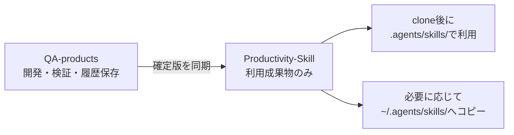

# QA-products

このリポジトリは、Quality Loopの開発正本、検証、設計判断、開発経緯を保存する場所です。実務者が利用する成果物は、別リポジトリの[Productivity-Skill](https://github.com/syrius2000/Productivity-Skill)へ確定版として取り込みます。



## 利用者向けの入口

実務でQuality Loopを使う場合は、[Productivity-Skill](https://github.com/syrius2000/Productivity-Skill)をcloneしてください。clone後、リポジトリ直下の`.agents/skills/`にある次のSkillをそのまま利用できます。

- `quality-review`: Reviewerの初回レビュー、Plan評価、独立検証、最終リスク評価
- `quality-response`: ImplementerのResponse Plan提出、修正提出、Evidence添付

複数のリポジトリで共通利用する場合だけ、次の2ディレクトリをグローバル領域へコピーします。

```text
Productivity-Skill/.agents/skills/quality-review/
Productivity-Skill/.agents/skills/quality-response/
→ ~/.agents/skills/
```

各Skillは、`SKILL.md`、CLIラッパー、`runtime/quality_loop/`を含む単独配置可能なパッケージです。外部pipパッケージは必要ありません。正式な対応方針はPython 3.10以上、標準ライブラリのみです。

## QA-productsで管理するもの

- `quality-loop/`: Quality Loopの開発正本、仕様、テスト、例、開発用Skill
- `scripts/`: Productivity-Skillへの同期、runtime同一性、Markdownリンクの検査
- `docs/Archives/`: Markdown形式の開発史、設計判断、QA記録
- `archives/`: zip、tar.gzなどのバイナリ・原本アーカイブ
- `qms-cases/`: Quality Loop案件の正本とEvidence

開発史と設計判断の索引は[Archive案内](docs/Archives/README.md)から辿れます。現行の機能仕様は[Quality Loop README](quality-loop/README.md)と[機能仕様](quality-loop/FUNCTIONAL_SPEC.md)を参照してください。

## 開発者向け検証

```bash
cd quality-loop
python3 -B -m unittest discover -s tests -v
python3 -B -m quality_loop.cli --help
```

Python 3.10および現行Python環境での検証を行います。未検証の環境や外部LLM API接続を、対応済みとは扱いません。

## Productivity-Skillへの同期

同期はQA-products側から、人間が確定版を選んだ後に行います。Productivity-Skill側の作業ツリーがcleanであることを確認し、通常は次のdry-runで差分を確認します。

```bash
python3 scripts/sync_productivity_skills.py --dry-run
```

同期先がdirtyの場合は停止します。内容を確認して明示的に許可する場合だけ`--force`を使います。同期スクリプトはProductivity-Skill側へコピーしません。remoteへのpushはこのリポジトリの同期処理には含めません。

## アーカイブと開発継続

過去の計画、QA、OpenSpec、実装報告は、現在の利用導線と混同しないように整理します。開発史は`docs/Archives/history/`、設計・方針判断は`docs/Archives/decisions/`を基本とし、既存Git履歴と関連コミットを保持します。

開発継続中は詳細な履歴を保持し、安定後に保存用タグとブランチを作成してから、必要に応じてSquashを検討します。過去版を現行成果物へ戻す先祖返りは、同期前の比較検査で停止します。

## 変更時の境界

大きな変更は、先に日本語の実装計画を作成します。今回の整理計画は[implementation_plan_020_0901.md](docs/Artifacts/implementation_plan_020_0901.md)です。Productivity-Skillへの同期、既存Skillの上書き、旧資料の移動・削除、commit、remoteへのpushは対象と承認を分けて扱います。
