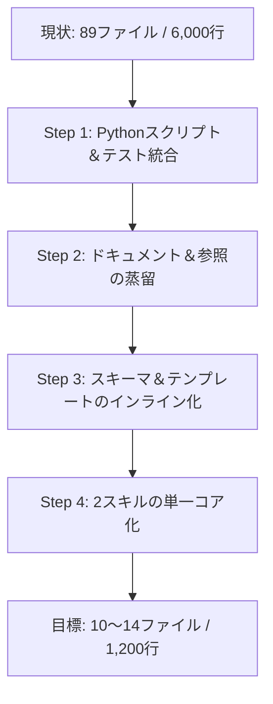

# spec-driven-qa-\* スキル コンパクト化・スリム化企画書 (`kikaku.md`)

## 1. エグゼクティブサマリー

`~/.agents/skills/` 配下の `spec-driven-qa-review` および `spec-driven-qa-author-response` は、厳格な品質保証（QA）ワークフローと多重AI間レビューを実現する優れたアーキテクチャを持つ一方、**過剰なスクリプト細分化、参照文書の重複、スキーマ・サンプルの多重保持**により、合計 **89ファイル / 約6,030行 / 約218KB** にまで肥大化しています。

本企画では、AIエージェントのコンテキストウィンドウ（トークン消費）の最適化と保守性・ポータビリティの向上を目的に、**ファイル数を約10〜14ファイル（約85%減）、コード行数を約1,200行（約75〜80%減）に集約・コンパクト化**する方針を定めます。

---

## 2. 現状のボリューム分析 (`wc` 集計結果)

### 2.1 スキル別サマリー

| スキル名                             | ファイル数 | 行数 (Lines) | 単語数 (Words) |    バイト数 (Bytes)    |
| :----------------------------------- | :--------: | :----------: | :------------: | :--------------------: |
| **`spec-driven-qa-review`**          |     60     |    5,287     |     15,879     |   190,260 (約190 KB)   |
| **`spec-driven-qa-author-response`** |     29     |     741      |     1,875      |    28,583 (約28 KB)    |
| **合計**                             |   **89**   |  **6,028**   |   **17,754**   | **218,843 (約218 KB)** |

### 2.2 カテゴリ別内訳 (spec-driven-qa-review)

| ディレクトリ / 分類 | ファイル数 | 行数  | 割合(行数) | 主な役割と現状の課題                                                                                           |
| :------------------ | :--------: | :---: | :--------: | :------------------------------------------------------------------------------------------------------------- |
| `scripts/`          |     22     | 1,515 |   28.7%    | 単機能ごとにファイルが過剰に細分化されている (`cycle_limit.py`, `digest.py`, `evidence.py`, `freshness.py` 等) |
| `tests/`            |     15     |  748  |   14.1%    | 22個の各スクリプトに対応するpytestファイルが多数存在                                                           |
| `references/`       |     9      |  564  |   10.7%    | 分類学、リスクプロファイル、セキュリティ等の個別ドキュメント。SKILL.mdと重複あり                               |
| `examples/`         |     16     |  396  |    7.5%    | single-cycle / multi-cycle の多数のMD/YAMLサンプル                                                             |
| `schemas/`          |     7      |  357  |    6.8%    | 分割された JSON Schema 定義群                                                                                  |
| `templates/`        |     9      |  332  |    6.3%    | 各種マークダウン/YAMLテンプレート                                                                              |
| `SKILL.md`          |     1      |  280  |    5.3%    | 単独で280行（約13.3KB）。エージェントの常駐プロンプトとして重い                                                |
| ルート文書・設定    |     5      |  213  |    4.0%    | `README.md`, `INSTALL.md`, `CHANGELOG.md`, `MANIFEST.txt`, `pyproject.toml`                                    |
| `integrations/`     |     2      |  36   |    0.7%    | GitHub Actions, pre-commit の例                                                                                |

### 2.3 カテゴリ別内訳 (spec-driven-qa-author-response)

| ディレクトリ / 分類   | ファイル数 | 行数 | 割合(行数) | 主な役割と現状の課題                                 |
| :-------------------- | :--------: | :--: | :--------: | :--------------------------------------------------- |
| `scripts/` + `tests/` |     8      | 467  |   63.0%    | レビュー側の検証処理と重複したロジックを保持         |
| `examples/`           |     15     | 102  |   13.8%    | accepted, fix-submitted, rejected の各バリエーション |
| `SKILL.md`            |     1      |  52  |    7.0%    | 52行 (約3.3KB)                                       |
| `references/`         |     3      |  22  |    3.0%    | 非常に短小な方針メモ                                 |
| ルート文書・設定      |     5      |  98  |   13.2%    | 設定・パッケージ管理ファイル                         |

---

## 3. なぜ肥大化したか？（課題の構造）

1. **スクリプトのマイクロ・モジュール化**
   - 20〜50行程度の小規模なPythonスクリプトが20本以上作成されており、ボイラープレート（引数解析、インポート、共通処理呼び出し）とテストが急増している。
2. **コンテキストトークンの無駄な消費**
   - エージェントがスキルをロードする際、`SKILL.md` が280行あり、さらに `references/` や `schemas/` が別個に存在するため、エージェントが必要なルールを把握するために多数のファイル読み込みステップが発生する。
3. **2スキルの二重管理**
   - 「レビュアー視点 (`spec-driven-qa-review`)」と「実装者・回答者視点 (`spec-driven-qa-author-response`)」でスキルディレクトリを完全に二重化しており、スクリプトやスキーマの重複が発生している。

---

## 4. コンパクト化・スリム化の基本方針

### 基本思想

> **「単一責任のツールキット化」と「プロンプト親和性の最大化」**
>
> - スクリプトは 1 本の堅牢な CLI (`qa_tool.py`) に統合する。
> - ルールと仕様は 1 つのコンパクトな `SKILL.md` + 1 つの `REFERENCE.md` に集約する。
> - 2つの役割（Reviewer / Author）は同一スキル内のモードまたは薄いエイリアスとして統合する。

---

## 5. 具体的なスリム化計画（4つのステップ）



### Step 1: Pythonスクリプトとテストの統合 (CLIモノリス化)

- **現状**: 26個のスクリプト + 19個のテスト = 45ファイル (約2,700行)
- **改善後**:
  - `scripts/qa_tool.py` (約400〜500行) に全機能を統合。
    - サブコマンド形式: `qa_tool.py init`, `qa_tool.py validate`, `qa_tool.py respond`, `qa_tool.py close`, `qa_tool.py render-handoff`
  - `tests/test_qa_tool.py` (約150〜200行) に主要ワークフローのE2Eテスト・ユニットテストを統合。
- **効果**: ファイル数 -43、コード行数 約2,000行削減。

### Step 2: ドキュメントとルールの凝縮 (コンテキスト効率化)

- **現状**: `references/*.md` (計12ファイル) + `SKILL.md` (2ファイル)
- **改善後**:
  - `SKILL.md`: 80〜100行程度に厳選。エージェントが真っ先に遵守すべき「フロー、禁止事項、状態遷移、終了条件」のみを明記。
  - `references/SPEC.md`: Taxonomy（分類）、リスクプロファイル、証拠階層、REQUIREDマーカーの仕様を1ファイル（約150行）に統合。
- **効果**: トークン消費削減、エージェントのファイル探索往復の排除。

### Step 3: スキーマ・テンプレート・サンプルの軽量化

- **現状**: `schemas/` (7ファイル) + `templates/` (9ファイル) + `examples/` (31ファイル)
- **改善後**:
  - スキーマ: Python標準の `dataclasses` または `qa_tool.py` 内蔵バリデータに統合（JSON Schemaファイルを全廃または1つの `case_schema.json` に集約）。
  - テンプレート: `templates/review-case.md`（ケース用）と `findings.yaml` の2〜3ファイルに集約。
  - サンプル: `examples/sample-case/`（1サイクル〜完了までの最小完全セット1組）のみに絞り込む。

### Step 4: Reviewer と Author-Response の統合

- **アプローチ案**:
  - **統合案 (推奨)**: `spec-driven-qa` という単一スキルにし、プロンプト起動時に `--role reviewer` または `--role author` を指定する構成にする。
  - **薄いラッパー案**: `spec-driven-qa-author-response` を残す場合は、本体コードを持たず `spec-driven-qa-review` の `qa_tool.py` を呼び出すだけの極小スキル（`SKILL.md` 1ファイルのみ）にする。

---

## 6. 目標指標 (KPI)

| 指標                          |     現状     |  コンパクト化後 (目標)   |     削減率      |
| :---------------------------- | :----------: | :----------------------: | :-------------: |
| **ファイル総数**              | 89 ファイル  |  **10 〜 14 ファイル**   | **約 85% 削減** |
| **総コード/ドキュメント行数** |   6,028 行   | **約 1,200 〜 1,500 行** | **約 75% 削減** |
| **SKILL.md 行数**             | 280行 + 52行 |   **約 80 〜 100 行**    | **約 70% 削減** |
| **ディスク/トークン容量**     |    218 KB    |    **約 40 〜 50 KB**    | **約 80% 削減** |

---

## 7. 新しいディレクトリ構造イメージ (統合後)

```text
spec-driven-qa/
├── SKILL.md                  # 約80行: エージェント向け中核プロンプト（Review/Response両対応）
├── README.md                 # 概要とCLIの使い方
├── references/
│   └── SPEC.md               # 分類学・証拠基準・状態遷移の統合仕様
├── templates/
│   ├── review-case.md        # QAケース用テンプレート
│   └── findings.yaml         # 指摘・回答用YAMLテンプレート
├── examples/
│   └── sample-case/          # 代表的な1件の完全なQAサイクル実例
├── scripts/
│   └── qa_tool.py            # 標準ライブラリのみで動く単一のCLIツール (init/validate/handoff/close)
└── tests/
    └── test_qa_tool.py       # qa_tool.py の網羅的テスト
```

---

## 8. 次のアクション

1. **企画方針の確認**: 本企画の統合・集約方針の確定
2. **`qa_tool.py` の設計と実装**: 既存22スクリプトのコアロジックを統合した単一ツールの作成
3. **ドキュメント・テンプレートの蒸留**: `SKILL.md` および `references/SPEC.md` の作成

---

4. **テスト検証と旧ファイル整理**: 既存機能の互換性を担保した上で旧ファイルを置換
