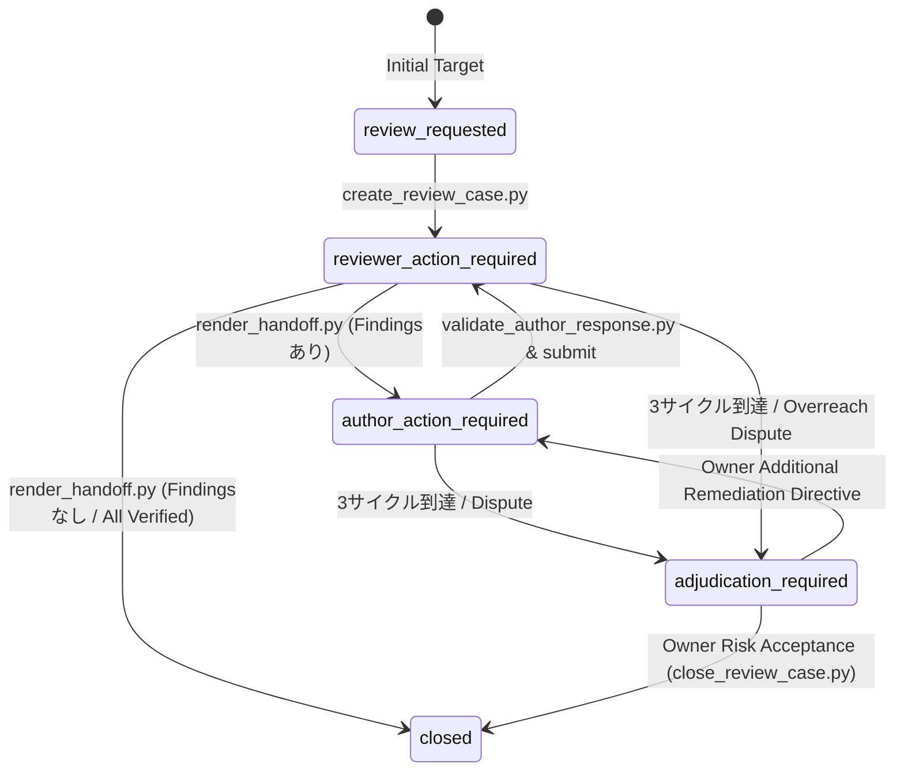

# Spec-Driven QA QMS Contract v1.2 設計仕様書 (Draft)

- **作成日時**: 2026-08-25 19:50 (JST)
- **ステータス**: DRAFT / APPROVED (Grilling Round 1 合意済み)
- **対象スキル**:
  - `spec-driven-qa-review` (v1.2.0 / Contract 1.2)
  - `spec-driven-qa-author-response` (v1.2.0 / Contract 1.2)
- **参照元**:
  - `GPT-findings.md` (Codex / Antigravity 統合レビュー)
  - `Downloads/spec-driven-qa-qms-v1.1.0` (QMS 思想・哲学)
  - `~/.agents/skills/` (現行資産・実運用実績)

---

## 1. 最上位哲学 (Core Doctrine)

> **品質は完全性ではない。人が定めた意図した用途（Intended Use）・要求事項（Requirements）・適用義務（Obligations）・リスク文脈（Risk Context）に対して、合理的に十分であることを意味する。**

- **Human / Owner**: Quality Intent（品質意図）および最終的な残余リスク受容（Residual Risk Acceptance）を所有する。
- **AI-1 / Author (実装者)**: 実装と反証 Evidence を所有する。自分のコードに合わせて品質基準を勝手に下げてはならない。
- **AI-2 / Reviewer (独立QA)**: 独立した検証と Findings を所有する。理論上の完全性や過剰なベストプラクティスを強制（Overreach）してはならない。

---

## 2. ドメイン用語集 (Ubiquitous Language)

| 用語                           | 定義                                                                                                                                                                                      | 責務 / 所有者               |
| :----------------------------- | :---------------------------------------------------------------------------------------------------------------------------------------------------------------------------------------- | :-------------------------- |
| **Quality Intent**             | 人が定義した「なぜ作るか」「誰がどう使うか」「何をもって十分とするか」「許容できない故障」の境界定義。                                                                                    | Human / Owner               |
| **Handoff Contract**           | AI-1 と AI-2 の間で、現在フェーズ・対象 Finding・実装許可・ベース Revision を引き継ぐ公開インターフェース（`handoff.md`）。                                                               | Reviewer 発行 / Author 遵守 |
| **Content Digest**             | 正本ファイル群の LF 正規化ハッシュ。テキストの無害な改行差異を許容しつつ、変更を検知（不一致時は「再生成要求」）。                                                                        | システム自動算出            |
| **Semantic Digest**            | `case_id`, `case_revision`, `cycle_number`, `target_findings`, `permission`, `next_action` の 6 構造化キーのみをハッシュ化したもの。不一致時は「不正改ざん」として即時停止（`blocked`）。 | システム自動算出            |
| **Response Plan**              | Medium 以上の Finding に対し、コードを修正する前に Author が提出し、Reviewer が事前合意する修正方針。                                                                                     | Author 策定 / Reviewer 承認 |
| **Eligible Fast Path**         | Low・局所的・可逆・非破壊かつ事前承認範囲内の修正に限り、Response Plan をスキップして即時実装提出を認める安全なバイパス経路。                                                             | 判定式による機械検証        |
| **Residual Risk Adjudication** | 3 サイクル上限到達時や未解決指摘に対し、人間が 1 分で受容／追加改修／保留を判断できるように要約された最終リスク圧縮層。                                                                   | Reviewer 推奨 / Human 裁定  |

---

## 3. アーキテクチャ決定記録 (Architectural Decisions)

### ADR-001: 二重ダイジェスト（Content / Semantic Digest）と楽観的比較更新

- **文脈**: 単純な Raw SHA-256 では改行コード等の差異で偽陽性ブロック（False Block）が発生し、逆にダイジェストなしでは状態不整合や競合上書きが発生する。
- **決定**:
  1. `content_digest`（LF 正規化テキストハッシュ）の不一致は「最新正本からの再描画要求（Warning）」とする。
  2. `semantic_digest`（構造化 6 キーのソート済み JSON ハッシュ）の不一致は「状態破損（`blocked: inconsistent-qa-state`）」とする。
  3. `expected_source_digest` による楽観的比較更新（OCC）を行い、他者による先行更新があれば上書きせず正本再読込へ戻る。
- **効果**: 偽陽性ブロックを 100% 排除しつつ、Finding ID や権限の改ざん・競合上書きを完全に阻止する。

### ADR-002: 永続状態 3 軸モデルと Finding カプセル化

- **文脈**: 6 つの独立変数を LLM に手作業で整合させようとすると、状態爆発と誤更新のリスクが高まる。
- **決定**:
  1. ケース全体の永続フィールドは `case_status`（大状態）、`next_action`（次の工程）、`case_revision` の 3 軸のみとする。
  2. Finding ごとに `finding_status`（Reviewer 判定）、`author_disposition`（Author 回答）、`owner_disposition`（Owner 裁定）をカプセル化する。
  3. `workflow_phase` や `terminal_result` は自動算出（導出値）とする。
- **効果**: エージェントの認知負荷を最小化し、破綻のない状態遷移を実現する。

### ADR-003: Author 権限境界（Read/Write Allowlist）と二段階正本反映

- **文脈**: Author が QA 正本ファイルを直接書き換えると、独立 QA の客観性と監査証跡が損なわれる。
- **決定**:
  1. **Read Allowlist**: `handoff.md`、対象コード、テスト、実行ログ、Evidence、仕様書。
  2. **Write Allowlist**: `cycles/cycle-NN-author-response.md` または `author-submissions/` のみ。
  3. **Write Denylist (厳禁)**: `review.md`, `findings.yaml`, `events.jsonl`, Severity, Closure への直接書込み。
  4. Author 提出後、Reviewer スクリプトが Disposition をパース・突合して正本へマージし、Reviewer が Verification を上書きする二段階フローとする。
- **効果**: AI-1 による自己クローズや Severity の勝手な引き下げを物理的に排除する。

### ADR-004: 簡約された Fast Path 判定式

- **文脈**: 全ての軽微修正に過剰な承認ステップを強制すると開発速度が失われる。
- **決定**:
  ```text
  can_execute =
    repository_policy_allows
    AND user_authorization_covers_scope
    AND (handoff_permission OR eligible_fast_path)
  ```
  `eligible_fast_path` の成立条件（すべて AND）:
  - Severity が Low またはドキュメント/コメント修正
  - 単一ファイルまたは限定された局所スコープ
  - 可逆的かつ非破壊的（既存データを破壊しない）
  - 外部ネットワーク通信・権限昇格なし
  - ユーザーが事前に明示許可した作業範囲内
- **効果**: 安全性を一切犠牲にせず、軽微な修正の高速ループ（Fast-Path）を担保する。

### ADR-005: 既存 QA ケースの `legacy-readonly` 保証と安全なステージング配備

- **文脈**: 新 Contract 導入で過去の QA 履歴（`QA-0001` 等）を破壊したり、グローバル環境を直接汚染してはならない。
- **決定**:
  1. 既存の v1.0/v1.1 ケースは自動判別し `legacy-readonly` として保護する（無断書換え禁止）。
  2. グローバルスキル（`~/.agents/skills/`）への配備前に、独立した stage 環境で回帰テストスイート（`run_evals.py`）を 100% 通過させる。
  3. 既存キャッシュ（`__pycache__`, `.pytest_cache`）を配布対象から除外する。
- **効果**: 過去の監査証跡の不変性と、安全確実な本番配備を保証する。

---

## 4. 状態遷移マトリクス (State Transition Matrix)



---

## 5. スクリプト構成と名前空間分離

```text
.agent/skills/ (または ~/.agents/skills/)
├── spec-driven-qa-review/
│   ├── scripts/
│   │   ├── review_common.py            # レビューア専用共通ライブラリ
│   │   ├── create_review_case.py       # ケース初期化・baseline記録
│   │   ├── render_handoff.py           # semantic/content digest 自動生成
│   │   ├── validate_review_case.py     # 正本整合性・リンク相対化検証
│   │   ├── validate_handoff.py         # handoff 整合性検証
│   │   ├── update_review_summary.py    # Author Response パース & 正本マージ
│   │   ├── close_review_case.py        # 最終クローズ & 裁定記録
│   │   └── adapters/
│   │       └── openspec_bridge.py      # OpenSpec change 自動連携
│   ├── schemas/                        # JSON Schema (小文字 enum 統一)
│   └── templates/                      # Markdown / YAML テンプレート
│
└── spec-driven-qa-author-response/
    ├── scripts/
    │   ├── author_common.py            # 実装者専用共通ライブラリ
    │   ├── locate_qa_case.py           # actionable な handoff.md 探索
    │   ├── create_author_response.py   # 回答雛形生成 (Read Allowlist 準拠)
    │   ├── validate_author_response.py # ケース突合・Digest・Fast Path 検証
    │   └── append_author_event.py      # 提出イベント記録
    └── templates/                      # 回答・計画テンプレート
```

---

## 6. 自動回帰テスト計画 (`run_evals.py`)

以下の 12 のモックシナリオを stage 環境で実行し、全てパスすることを配備の必須ゲートとする。

| ID        | テストシナリオ         | 期待される動作 (Pass 条件)                                            |
| :-------- | :--------------------- | :-------------------------------------------------------------------- |
| **TC-01** | 初回 QA レビュー指示   | 正しいスコープで QA ケースと `handoff.md` が生成されること            |
| **TC-02** | 再点検（Recheck）指示  | 一意な actionable ケースを自動特定し、検証フェーズに進むこと          |
| **TC-03** | Medium/High 指摘の対応 | 実装を行わず Response Plan を提出すること                             |
| **TC-04** | 偽 Finding ID の提出   | `validate_author_response.py` がエラーコードで即座に拒否すること      |
| **TC-05** | 未許可実装の提出       | `implementation_permission: false` 時の実装提出を拒否すること         |
| **TC-06** | Stale Content Digest   | 正本テキスト更新時に「再生成要求」の警告が出ること                    |
| **TC-07** | Stale Semantic Digest  | 構造化キー変更時に `blocked: inconsistent-qa-state` で停止すること    |
| **TC-08** | Author 自己クローズ    | Author によるケース完了・クローズ要求を物理的に拒否すること           |
| **TC-09** | Fast Path 正常適用     | Low 指摘・局所変更・承認範囲内での即時修正提出がパスすること          |
| **TC-10** | Fast Path 違反拒否     | Medium 指摘での Fast Path 試行がブロックされること                    |
| **TC-11** | 相対リンク強制         | レポート内の `file://` や絶対パスが拒否され、相対パスが要求されること |
| **TC-12** | 楽観的比較更新競合     | 古い `expected_source_digest` による上書きが拒否されること            |

---

## 7. 実装・ステージング配備ロードマップ

1. **Phase 1: Stage 作業領域の準備** (`/tmp/qa-skill-stage/` または `stage/`)
2. **Phase 2: Contract v1.2 スクリプト & スキーマの実装**（名前空間分離、二重ダイジェスト、Allowlist）
3. **Phase 3: OpenSpec Bridge & 相対リンク検証の実装**
4. **Phase 4: `run_evals.py` による 12 件の E2E 回帰テスト実行・検証**
5. **Phase 5: 既存 `~/.agents/skills/` のバックアップ確保 & 正式配備**
